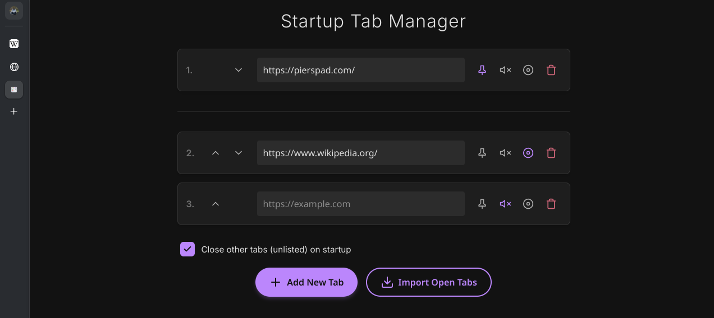

# Startup Tab Manager

## Main Features

* Automatically opens configured tabs on startup. If a tab with the desired URL is already open, it is reused and moved to the correct position instead of being duplicated.
* For each tab, you can define:
    * **URL:** The address to load.
    * **Pinned:** Whether the tab should be pinned.
    * **Muted:** Whether the tab should start muted.
    * **Focus:** Which specific tab should have focus (be visible) after loading.
* Optional "Close other tabs" setting which, if enabled, closes all tabs not present in your saved list, ensuring a clean workspace.
* Import all currently open tabs in the current window with a single click to quickly create your initial configuration.

---

## Contributing

Pull requests are welcome! For major changes, please open an issue first to discuss your ideas.

---

## AI Disclosure

This project was developed with the assistance of Large Language Models, used to support code writing and documentation.

---

## License

This project is licensed under the GPL v3 License – see the [LICENSE](LICENSE) file for details.
